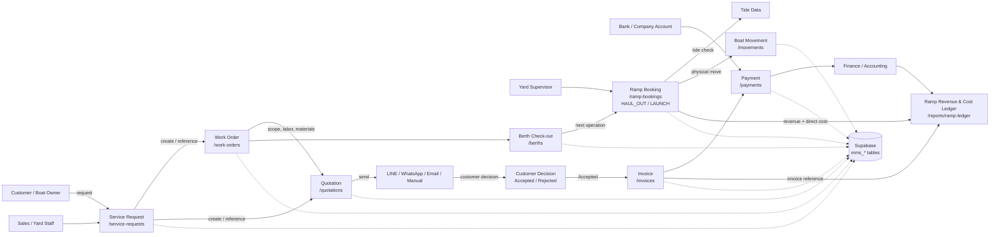
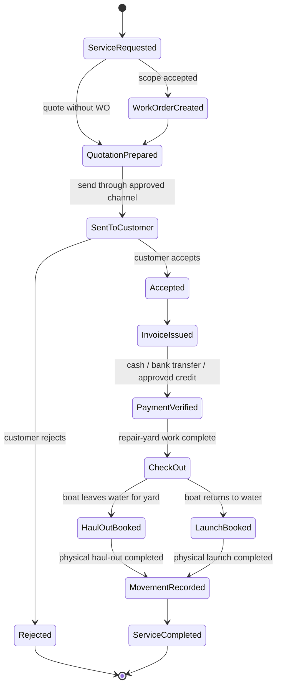

# Marina MMS Service Workflow Context Diagram

สถานะจากการตรวจโค้ดใน `C:\marina-mms` ณ 2026-08-30

## Context Diagram

Legend: solid arrows are the intended business flow; dotted arrows are persistence through the Supabase tables. The diagram describes the target operational flow and the matrix below records the current implementation state.

## Document Traceability

| Step | Page / module | Main table | Current state | Gap or control |
|---|---|---|---|---|
| 1 | Service Requests | `mms_service_requests` | Connected to customer/boat and can start the service workflow | Must carry one stable service request reference through all downstream documents |
| 2 | Work Orders | `mms_work_orders`, tasks, timesheets, materials | Work order scope and costing exist; links were added by the connected-workflow change | Production must run the matching migration before new links can be created |
| 3 | Quotations | `mms_quotations`, `mms_quotation_items` | Can be created from the service flow and retains upstream references | Customer decision and delivery channel still need operational completion rules |
| 4 | Approval | quotation status | `ACCEPTED` is represented as a quotation status | Acceptance should be the only gate for invoice creation |
| 5 | Invoice | `mms_invoices`, `mms_invoice_items` | Invoice has quotation/work order references, payment tracking, and an optional ramp booking reference | The invoice link is additive; existing invoices remain unchanged |
| 6 | Payment | `mms_payments` | Payment records update invoice paid/outstanding state | Bank transfer proof and credit authorization remain manual controls |
| 7 | Berth check-out | `mms_berths`, `mms_berth_assignments`, `mms_boats` | Management edit flow can complete an assignment and free the berth | The detail-page Check Out button has no handler and must be fixed before treating it as a reliable workflow action |
| 8 | Ramp Booking | `mms_ramp_bookings` | Existing booking/status/tide flow exists; `HAUL_OUT` and `LAUNCH` are now the operation names | Booking must be the formal next step after check-out, not a separate unrelated record |
| 9 | Boat Movement | `mms_boat_movements` | Manual movement log exists | Completion of a ramp booking should create or require the corresponding physical movement record |
| 10 | Accounting | ramp booking financial fields + ledger page | Revenue, estimated direct cost, accounts, and invoice reference are implemented in code | Production migration is pending; actual cost and invoice posting need a controlled update path, not free-text only |

## Target State Machine

## Real-World Fit Review

### Already aligned

- One service request can become a work order and/or quotation.
- Work order costing separates labor, materials, and contractor cost.
- Quotation acceptance is distinguishable from draft/sent/rejected.
- Invoice and payment are separate records.
- Ramp booking already has date, time, tide-safety inputs, staff, and status transitions.
- `HAUL_OUT` and `LAUNCH` now describe the two physical ramp operations explicitly.

### Not yet fully aligned

- The detail-page Check Out action is currently only visual; the management edit path contains the actual completion logic.
- There is no enforced application gate that says: confirm launch date/time -> read customer payment condition -> verify cash/bank transfer or approved credit -> allow Launch.
- Ramp Booking is now a derived financial source record for revenue and estimated direct cost. A finance user still needs to link or create the invoice deliberately; this is not yet a double-entry posting journal.
- Completing a ramp booking does not yet automatically create a boat movement record and update the boat location/status as one atomic operation.
- Legacy data may contain separate document references or manual text references; those records should be preserved and progressively linked, not deleted.

## Recommended Implementation Order

1. Apply the additive ramp migration and verify the live schema.
2. Use `HAUL_OUT` or `LAUNCH` as the only new operation codes; preserve old records by updating their value, not deleting rows.
3. Make Check Out a real action that completes the active assignment and records the actual check-out date/time.
4. Add the post-check-out action `Create Ramp Booking`, prefilled with the boat/customer and upstream document references.
5. Require a confirmed date/time and payment decision before a Launch booking can move to `CONFIRMED` or `IN_PROGRESS`.
6. On completion, create the matching `HAUL_OUT`/`LAUNCH` movement and update the boat location/status.
7. Link the ramp booking to the invoice and show revenue, cost, invoice status, and movement status in the ledger.
